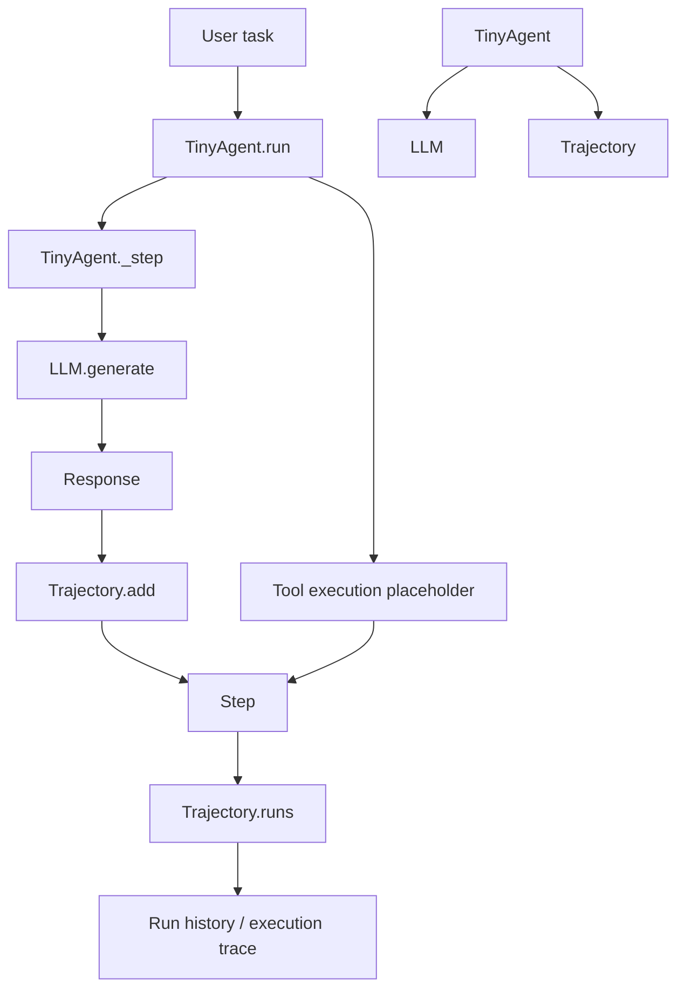

# Tiny Agent

Tiny Agent is a minimal agent framework built around a simple pattern: send a task to an LLM, capture the structured output, record each step in a trajectory, and keep a history of the agent's execution.

## Core classes

### LLM
The `LLM` class is the interface to the language model API. It stores the model name, base URL, API key, and whether the model should think. Its `generate()` method builds the request payload, sends it to an OpenAI-compatible chat completion endpoint, parses the JSON response, and returns a `Response` object.

### Response
`Response` is a dataclass used to represent the outcome of a single LLM call. It contains:
- `content`: the main answer text
- `reasoning`: reasoning or thought content returned by the model
- `tool_call`: any tool invocation payload returned by the model
- `metadata`: information such as model name and token usage

### Step
A `Step` represents one unit of work inside an agent run. It records:
- `thought`: what the agent was thinking
- `action`: the tool call that was triggered, if any
- `observation`: the result of that call
- `answer`: the final answer for the step
- `metadata`: additional contextual data

### Trajectory
`Trajectory` keeps the execution history for the agent. It stores a list of runs, where each run has a `query` and a list of `steps`. `initialize()` starts a new run, and `add()` converts a `Response` into a `Step` and appends it to the current run.

### TinyAgent
`TinyAgent` is the orchestrator that wires everything together. It owns an `LLM` and a `Trajectory`, starts a new run for a task, calls the model, and logs the result. It is the main object that drives the agent loop.

## How the classes relate

In other words, the agent receives a task, asks the LLM for a response, turns that response into a step, and stores the step in the current trajectory so the complete execution history is preserved.

